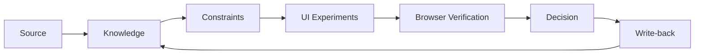
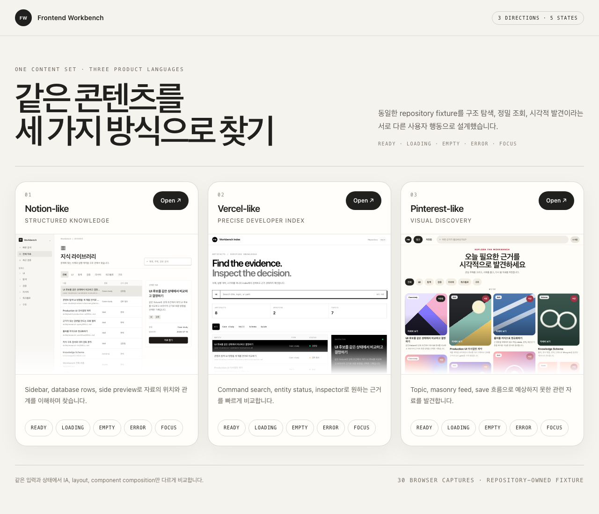

# Frontend AI Workbench

> Build with AI. Decide with evidence.

[](https://github.com/joseph0926/frontend-ai-workbench/actions/workflows/ci.yml) · [Live Gallery](https://joseph0926.github.io/frontend-ai-workbench/)

Frontend AI Workbench는 AI-assisted frontend 작업을 재현 가능한 의사결정 과정으로 만드는 공개 기술 프로젝트입니다. 문제와 제약을 먼저 고정하고, 같은 조건에서 후보를 비교한 뒤 브라우저와 출처 근거로 검증합니다. 구현에서 얻은 판단은 Knowledge와 재사용 가능한 Skill로 되돌립니다.



## 이 저장소가 보여주는 것

| 역량 | 공개 증거 | 현재 범위 |
| --- | --- | --- |
| 같은 계약에서 UI 방향 비교 | [UI Candidate Lab](#ui-candidate-lab), [case study](case-studies/ui-candidate-evaluation.md) | 3 candidates × 5 states × 2 viewports의 candidate exploration |
| 출처에서 판단까지 추적 | [Client State Recovery](knowledge/client-state-recovery/index.md), [query case study](case-studies/client-state-recovery-query.md) | 공개 source 3개를 4-page Knowledge graph로 정규화 |
| 반복 가능한 agent workflow 설계 | [`skills/`](skills/), smoke matrix와 decision packet | trigger, gate, evidence와 종료 조건을 가진 public edition |
| 실제 제품 통합 workflow | [`build-production-ui`](skills/build-production-ui/SKILL.md) | v2 계약을 공개하고 최신 production run은 별도 evidence로 완주 예정 |

### AI와 사람의 책임

| AI가 가속하는 작업 | 사람이 소유하는 결정 |
| --- | --- |
| 후보 생성, source 탐색, 반복 구현, 검사 실행 | 문제 정의, invariant와 acceptance, 공개 경계, 최종 선택 |
| 비교표, screenshot matrix, Knowledge 초안 | 근거의 충분성, 제품 적합성, 보안·접근성 판단 |
| 반복되는 판단을 Skill과 validator로 정리 | 승인 gate, production 통합과 완료 선언 |

AI가 생성했다는 사실만으로 결과를 채택하지 않습니다. 확인 가능한 source, 브라우저 상태와 결정적 검사를 통과한 범위만 완료로 기록합니다.

## 1분 검토 경로

1. [Gallery](artifacts/ui-lab/gallery-desktop.png)에서 같은 콘텐츠의 세 UI 방향을 비교합니다.
2. [UI case study](case-studies/ui-candidate-evaluation.md)에서 상태·반응형·interaction 검증을 확인합니다.
3. [Research case study](case-studies/client-state-recovery-query.md)에서 source → claim → synthesis 경로를 확인합니다.
4. [`build-production-ui`](skills/build-production-ui/SKILL.md)에서 같은 판단을 반복 실행하는 workflow 계약을 확인합니다.

## UI Candidate Lab

동일한 fixture와 상태 계약 아래 서로 다른 정보 구조와 interaction을 구현하고 비교합니다. Gallery와 각 candidate route는 같은 registry를 사용하며, Playwright harness가 desktop/mobile 화면과 주요 동작을 함께 검증합니다.

현재 `content-discovery` experiment는 하나의 콘텐츠 집합을 세 가지 탐색 모델로 제공합니다. 이 사례는 candidate exploration의 증거이며 production integration 전체를 완료했다는 주장은 하지 않습니다.

| Candidate | 탐색 모델 | 핵심 구조 |
| --- | --- | --- |
| Notion-like | 구조와 위치를 이해하며 탐색 | sidebar, database rows, detail preview |
| Vercel-like | 정확한 자료를 빠르게 조회 | command search, entity status, inspector |
| Pinterest-like | 훑다가 관련 자료를 발견하고 저장 | topic filter, masonry feed, save state |



| Notion-like | Vercel-like | Pinterest-like |
| --- | --- | --- |
| [](artifacts/ui-lab/content-discovery/final/notion-ready-desktop-1280x800-light-ko.png) | [](artifacts/ui-lab/content-discovery/final/vercel-ready-desktop-1280x800-light-ko.png) | [](artifacts/ui-lab/content-discovery/final/pinterest-ready-desktop-1280x800-light-ko.png) |

- 실행 계약: [`apps/ui-lab`](apps/ui-lab/README.md)
- 구현과 검증 기록: [같은 콘텐츠를 세 제품 언어로 비교하기](case-studies/ui-candidate-evaluation.md)

## Knowledge Base

원본 출처, 확인된 사실, 재사용할 판단과 여러 자료를 종합한 결론을 구분해 관리합니다. 각 page는 출처, 접근일, confidence, status와 relation을 가지며 구조 lint로 누락과 연결 문제를 검사합니다.

- 구조 계약: [`knowledge/SCHEMA.md`](knowledge/SCHEMA.md)
- Topic router: [`knowledge/index.md`](knowledge/index.md)
- 검사기: [`scripts/wiki-lint.py`](scripts/wiki-lint.py)
- 공개 사례: [Client State Recovery](knowledge/client-state-recovery/index.md)
- 근거 기반 질의: [공개 근거로 클라이언트 상태 복구 전략 조회하기](case-studies/client-state-recovery-query.md)

## Agent Skills

Skill은 단일 prompt가 아니라 trigger, 입력, 작업 경계, 산출물, 종료 조건과 smoke case를 가진 실행 계약입니다.

| Skill | 역할 | 공개 evidence |
| --- | --- | --- |
| [`build-production-ui`](skills/build-production-ui/SKILL.md) | 네 UI 방향에서 두 후보를 검증하고 승인된 방향만 production에 통합 | [candidate exploration 사례](case-studies/ui-candidate-evaluation.md), production run은 별도 추가 예정 |
| [`research-workflow`](skills/research-workflow/SKILL.md) | 출처를 Knowledge page로 정규화하고 topic lifecycle 관리 | [Client State Recovery topic](knowledge/client-state-recovery/index.md) |
| [`research-query`](skills/research-query/SKILL.md) | Knowledge graph에서 claim과 evidence gap 분리 | [상태 복구 전략 질의](case-studies/client-state-recovery-query.md) |
| [`research-lint`](skills/research-lint/SKILL.md) | 구조 검사 결과를 severity와 수정 책임으로 분류 | [동일 사례의 Quality gate](case-studies/client-state-recovery-query.md#quality-gate) |

Skill의 설치·복사·검증 방법은 [`skills/README.md`](skills/README.md)에 정리합니다.

## 시작하기

Node.js 24, pnpm 11과 Python 3.14를 기준으로 검증합니다.

```sh
pnpm install --frozen-lockfile
python -m pip install -r requirements.txt
```

UI Lab을 실행합니다.

```sh
pnpm ui:dev
```

`http://localhost:3001`에서 gallery를 열 수 있습니다. 각 화면은 `/view/:experiment/:candidate/:state` 경로로 직접 접근할 수 있습니다.

## 검증

```sh
pnpm ui:typecheck
pnpm ui:build
python scripts/wiki-lint.py knowledge
python -m unittest discover -s tests
```

브라우저 matrix를 다시 만들려면 개발 서버를 실행한 상태에서 별도 터미널로 다음 명령을 실행합니다.

```sh
pnpm ui:shots
```

현재 harness는 gallery 2개 viewport와 `3 candidates × 5 states × 2 viewports`를 검증하고 최종 PNG를 `artifacts/ui-lab/`에 저장합니다. `LAB_URL`, `LAB_ARTIFACT_DIR`, `CHROME_EXECUTABLE_PATH`로 실행 환경을 바꿀 수 있습니다.

## 저장소 구조

```text
apps/ui-lab/    UI experiment와 browser harness
artifacts/      문서가 참조하는 선별된 브라우저 근거
case-studies/   완료된 문제 해결과 검증 기록
knowledge/      출처 기반 지식과 schema
skills/         재사용 가능한 public-edition workflow
scripts/        결정적 검사 도구
tests/          검사 도구와 Skill 계약의 회귀 테스트
```

새 UI experiment는 `apps/ui-lab/src/experiments/` 아래에 추가하고 registry에 등록합니다. 모든 candidate가 동일한 상태 입력을 처리하도록 만든 뒤 typecheck, build, browser matrix를 통과시켜야 합니다. Knowledge page와 Skill은 각각 schema와 reference의 smoke case를 함께 갱신합니다.

원본 범주, 공개용 변경과 최신화 기준은 [`PROVENANCE.md`](PROVENANCE.md)를 따릅니다.

## 설계 원칙

1. 생성 전에 문제, 불변 조건과 완료 기준을 고정합니다.
2. 후보는 같은 입력과 상태에서 비교합니다.
3. 생성과 평가를 분리하고 선택에는 확인 가능한 근거를 붙입니다.
4. 정적 코드 검토에서 끝내지 않고 브라우저 동작, 상태, 반응형과 접근성을 확인합니다.
5. 채택한 결과뿐 아니라 trade-off와 남은 한계도 기록합니다.
6. 구현에서 얻은 재사용 가능한 판단은 Knowledge Base와 Skill로 환류합니다.

## License

[MIT](LICENSE)
