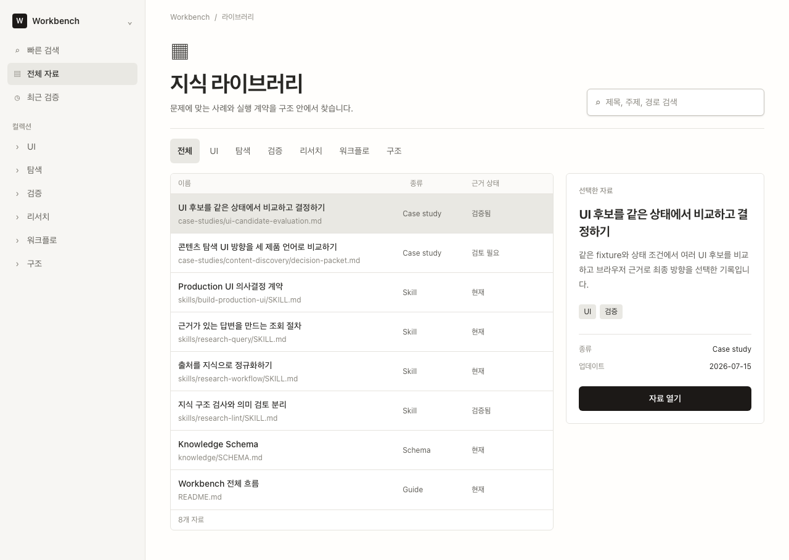
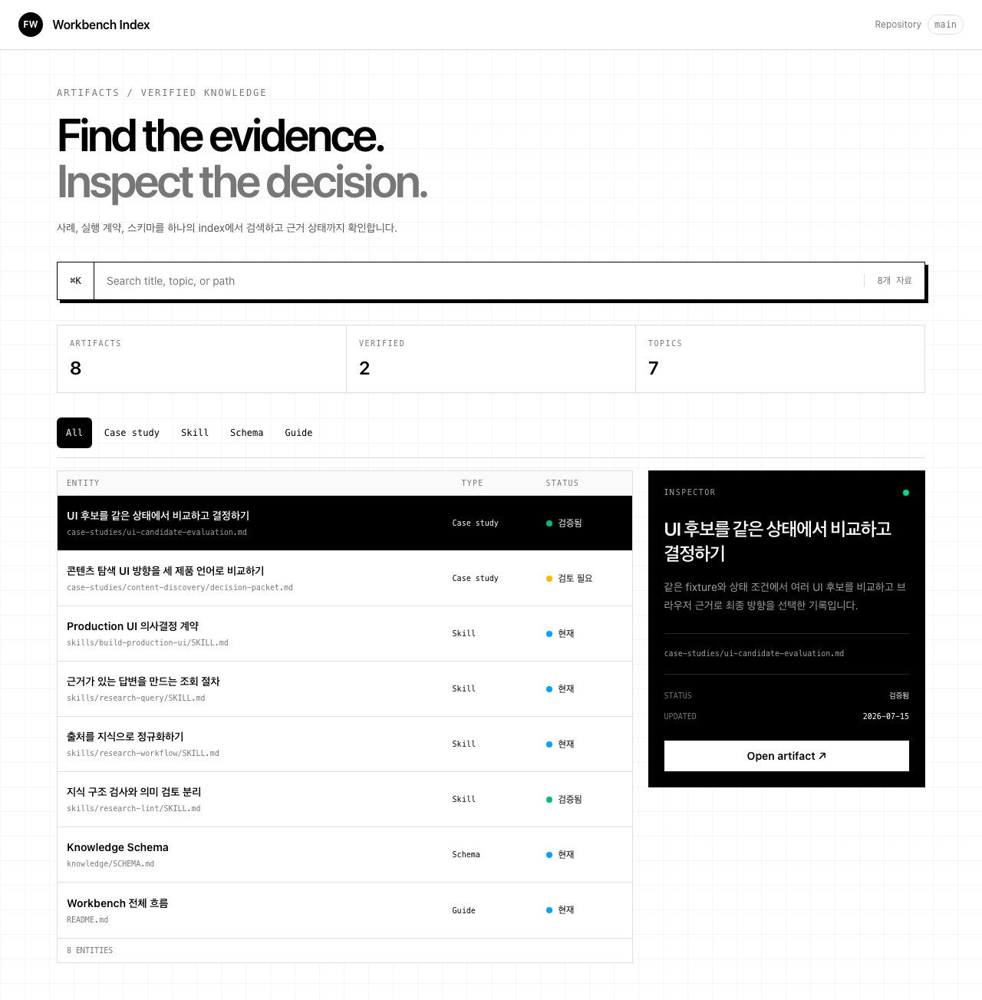
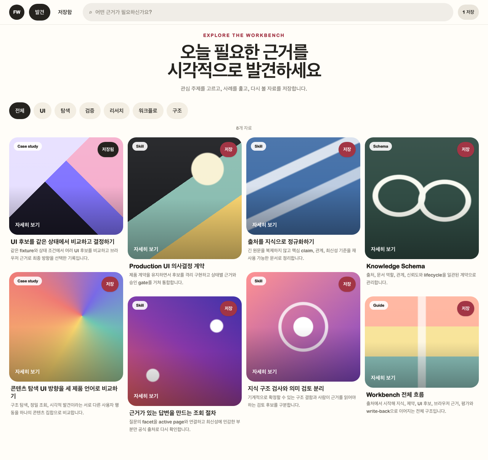

# 같은 콘텐츠를 세 제품 언어로 비교하기

## 문제

UI 후보를 같은 어두운 작업면 안에서 border와 배치만 달리하면 구현 수는 늘어도 제품 판단은 드러나지 않는다. 이 사례의 목표는 같은 콘텐츠를 서로 다른 사용자 행동으로 해석하고, 각 방향이 상태와 모바일에서도 실제로 성립하는지 확인하는 것이었다.

- 구조를 이해하며 자료를 찾는 경험은 어떻게 달라지는가?
- 정확한 artifact를 빠르게 조회할 때 필요한 정보는 무엇인가?
- 콘텐츠를 훑다가 예상하지 못한 관련 자료를 발견하게 만들 수 있는가?
- 회사의 시각 자산을 복제하지 않고 product language만 번역할 수 있는가?

## 제약

- 모든 후보는 같은 repository-owned fixture와 `{ state }` 입력을 사용한다.
- 회사 logo, font, raw color token과 screenshot을 복제하지 않는다.
- 각 후보의 outer shell, IA와 component composition은 독립적으로 설계한다.
- `ready`, `loading`, `empty`, `error`, `focus`를 모두 제공한다.
- 데스크톱과 모바일, 검색·필터·저장 interaction을 실제 브라우저에서 확인한다.
- 최종 화면에 인증정보, 개인정보, 비공개 경로나 운영 데이터를 넣지 않는다.

## 세 방향

| 방향 | 핵심 구조 | 사용자 행동 | 주요 trade-off |
| --- | --- | --- | --- |
| Notion-like | sidebar + database rows + side preview | 구조와 위치를 이해하며 탐색 | 실제 제품 복제로 보이지 않도록 표현 절제 필요 |
| Vercel-like | command search + entity status + inspector | 원하는 근거를 빠르게 조회·비교 | 모바일에서 dense index와 inspector가 길어짐 |
| Pinterest-like | topic + masonry feed + save | 훑다가 관련 자료를 발견하고 저장 | 시각 cover가 장식으로 끝나지 않도록 의미 연결 필요 |

세 방향 중 하나를 winner로 만들지 않았다. 서로 다른 탐색 모델의 장단점을 같은 조건에서 비교한다는 목적에 맞춰 구조 탐색, 정밀 조회, 시각적 발견을 독립 candidate로 유지했다.

## 구현 핵심

- [`Experiment` contract](../apps/ui-lab/src/experiments/types.ts)로 candidate와 상태 입력을 고정했다.
- [`registry`](../apps/ui-lab/src/experiments/registry.ts)를 gallery, production route와 screenshot harness가 함께 사용한다.
- [`content-discovery`](../apps/ui-lab/src/experiments/content-discovery/index.ts)는 세 candidate와 다섯 상태를 등록한다.
- [`gallery`](../apps/ui-lab/src/routes/gallery.tsx)는 세 candidate의 live preview와 상태 진입점을 한 화면에 보여준다.
- [`screenshot harness`](../apps/ui-lab/src/harness/shots.mjs)는 gallery와 모든 `candidate × state × viewport` 조합을 순회하며 interaction, focus, overflow를 검증한다.

```text
1 experiment × 3 candidates × 5 states × 2 viewports = 30 candidate captures
gallery × 2 viewports = 2 showcase captures
```

## AI와 사람의 역할

| AI가 가속한 작업 | 사람이 소유한 결정 |
| --- | --- |
| 세 candidate 구현, 공통 state 연결, 반복 browser matrix 실행 | 사용자 행동 세 가지의 구분, 공통 fixture·state invariant와 non-goal |
| 검색·filter·save interaction과 접근성 marker 점검 | winner를 억지로 정하지 않고 독립 탐색 모델로 유지한 판단 |
| 32개 viewport/state artifact 생성 | evidence 충분성, 공개 안전성, trade-off와 남은 한계 승인 |

생성된 화면 수는 판단의 품질을 대신하지 않는다. 사람의 역할은 같은 계약을 유지하고 각 방향이 실제로 다른 사용자 행동을 설명하는지 판정하는 것이다.

## 결과

| Notion-like | Vercel-like | Pinterest-like |
| --- | --- | --- |
| [](../artifacts/ui-lab/content-discovery/final/notion-ready-desktop-1280x800-light-ko.png) | [](../artifacts/ui-lab/content-discovery/final/vercel-ready-desktop-1280x800-light-ko.png) | [](../artifacts/ui-lab/content-discovery/final/pinterest-ready-desktop-1280x800-light-ko.png) |

- TypeScript 검사와 production build를 통과했다.
- Gallery desktop/mobile과 30개 production candidate route를 캡처했다.
- 검색 결과 announcement, topic/filter와 저장 상태를 semantic attribute로 확인했다.
- `aria-busy`, empty marker, alert recovery, visible focus와 accessible name을 검증했다.
- 375px 모바일에서 125% text scaling 후에도 root overflow가 발생하지 않았다.

## 남은 한계

- 저장소 문서 상세 route가 없어 `자료 열기`는 현재 탐색 affordance만 제공한다.
- 정적 fixture이므로 runtime refresh와 stale content 유지 상태는 포함하지 않는다.
- 회사 anchor는 시각 언어를 비교하기 위한 입력이며 각 회사의 실제 design system을 재현하거나 대표하지 않는다.
